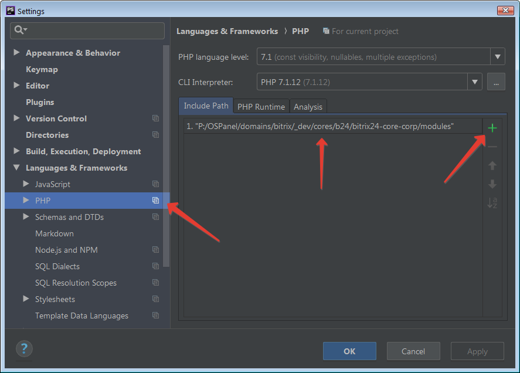

# Ядро "1С-Битрикс: Управление сайтом" Бизнес

* Кодировка: UTF-8

## История версий (Главный модуль)

* 21.400.300 (02.08.2021)
* 21.400.100 (16.07.2021)
* 21.300.0 (07.05.2021)
* 20.700.0 (28.01.2021)
* 20.500.400 (04.03.2021)
* 20.500.100 (02.12.2020)
* 20.300.0 (05.11.2020)
* 20.200.700 (20.01.2021)
* 20.200.550 (18.12.2020)
* 20.200.300 (26.11.2020)
* 20.5.475 (28.09.2020)
* 20.5.462 (08.10.2020)
* 20.0.1800 (25.08.2020)
* 20.0.1650 (16.07.2020)
* 20.0.650 (25.02.2020)
* 18.5.180 (29.04.2019)
* 18.0.0 (24.05.2018)
* 17.5.13 (22.03.2018)

## Для чего нужен данный репозиторий

* Отследить изменения в релизах "1С-Битрикс: Управление сайтом" Бизнес:
    * Т.е., в каком релизе добавился тот или иной модуль/компонент, какие изменения в нём произошли.

* Для быстрой корректировки проекта, например, на сервере, без необходимости скачивания или установки всего проекта:
    * Каталог /modules/ - 20.0.650 (25.02.2020) - содержит 52554 файлов
    * Просто добавляем в индексацию IDE и всё.

* Быстрое индексирование проекта PHPStorm при повторном подключении:
    * Т.е. достаточно подключать только данный каталог, без необходимости повторной индексации всей папки /bitrix/ (содержит более 90 тыс.файлов) на каждом проекте. Особенно актуально для медленных ПК без SSD;
    * Просто, храните данный репозиторий в одном постоянном месте, а проекты, где будет удобно.

* Вы всегда можете оперативно переключиться на нужную доступную версию ядра.

## Подключение в PHPStorm (рекомендуемый)

* 'Меню' > 'File' > 'Settings' > 'Languages & Frameworks' > 'PHP' > 'Include Path' > '+' > 'Путь к каталогу modules'

## Composer

* `composer require avshatalov48/bitrix-core-business:dev-master --dev`

## Разное

* С 01.04.2021 будет ограничена поддержка наших продуктов на PHP версии ниже 7.3.0. Рекомендуемая версия PHP - 7.4.0 и выше.
* 20.100.0 и выше - Совместимость с PHP 8
* 20.5.393 и выше - php mbstring.func_overload 0

## Полезные ссылки

* [История версий. Последние изменения в "1С-Битрикс: Управление сайтом"](https://dev.1c-bitrix.ru/docs/versions.php)
* [Ядро "1С-Битрикс24" Корпоративный портал. Каталог /modules/](https://github.com/avshatalov48/bitrix24-core-corp/)
* [Скачать "1С-Битрикс: Управление сайтом"](https://www.1c-bitrix.ru/download/cms.php)
* [Регистрация пробных версий продуктов и решений «1С-Битрикс»](https://www.1c-bitrix.ru/bsm_register.php)
* [bxApiDocs](https://github.com/matiaspub/bxApiDocs/)

Если данный репозиторий помог Вам, поставьте звездочку! :thumbsup: